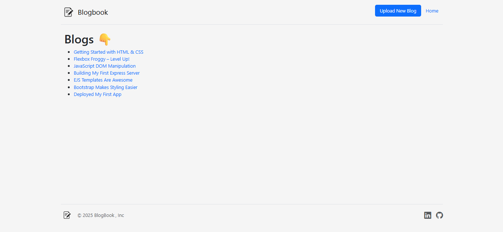

# 📖 BlogBook 

  
  
  
  
 

A simple yet powerful **Blog Web App** where users can create, read, update, and delete blog posts.  
Built with **Node.js, Express, EJS, and Bootstrap**, BlogBook is a great starter project to understand full-stack development concepts.  

---

## 🚀 Features  
- ✍️ Create new blog posts  
- 📚 Read all blogs in a clean UI  
- 🔄 Update/Edit existing posts  
- 🗑️ Delete posts easily  
- 🎨 Responsive design with Bootstrap  
- ⚡ Fast and lightweight  

---

## 🛠️ Tech Stack  
- **Frontend:** EJS, Bootstrap, CSS  
- **Backend:** Node.js, Express.js  
- **Database:** In-Memory Array for now  
- **Other:** Body-parser, Nodemon (for development)  

---

## 📂 Project Structure  
```
|public/                    #Static Files
|   |--Images/              #Logo.png and Screenshots
|   |--styles/              #CSS file
|views/                     #EJS Templates
|   |--partials/            #header.ejs and footer.ejs
|   |--index.ejs
|   |--post.ejs
|   |--edit.ejs
|   |--newpost.ejs
|--app.js                   #Main Server File
|--package-lock.json        #Dependencies and Scripts
|--package.json
```
---

## ⚙️ Installation & Setup  

1. **Clone the repo**  
   ```bash
   git clone https://github.com/ShouryaShinde/BlogBook.git
   cd BlogBook
2. **Install Dependencies**
   ```bash
   npm install
3. **Run the App**
   ```bash
   node app.js
4. **Open in Browser** 👉 [https://localhost:3000](https://localhost:3000)

---

## 📸 Screenshots



---

## 🤝 Contributing

Contributions, issues, and feature requests are welcome!
Feel free to fork the repo and submit a PR.

---

## 📜 License

This project is licensed under the MIT License.

---

## 👨‍💻 Author
***Shourya Anil Shinde***
- [GitHub](https://github.com/ShouryaShinde)
- [LinkedIn](https://www.linkedin.com/in/shourya-shinde-1a5425330/)
 
Made with ❤️ in India.
